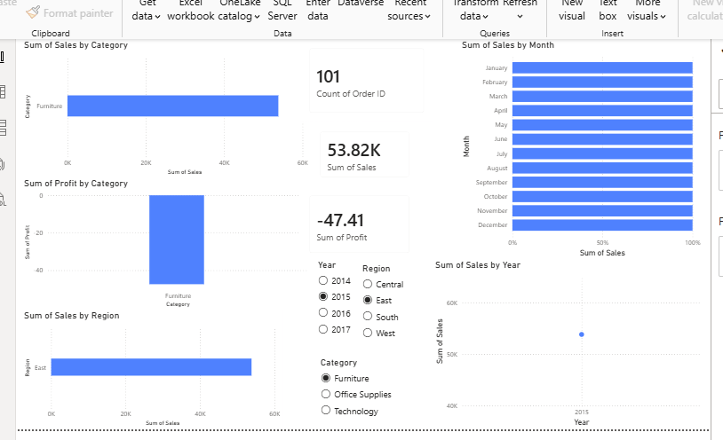
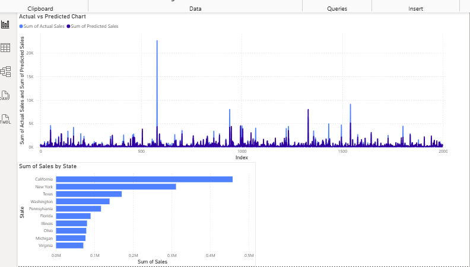

# 📈 AI Sales Prediction System

An end-to-end Data Science project that predicts future sales using Machine Learning and visualizes business insights with Power BI.

---

## 🚀 Project Overview

This project combines Data Analysis, Machine Learning, and Power BI to analyze historical sales data and predict future sales.

### Project Workflow
- Data Cleaning
- Exploratory Data Analysis (EDA)
- Feature Engineering
- Machine Learning Model (Random Forest Regressor)
- Sales Prediction
- Interactive Power BI Dashboard

---

## 🛠️ Technologies Used

- Python
- Pandas
- NumPy
- Matplotlib
- Scikit-learn
- Joblib
- Power BI

---

## 📊 Dashboard Features

- Sales by Category
- Sales by Region
- Monthly & Yearly Sales
- Profit Analysis
- Actual vs Predicted Sales
- Interactive Filters

---

## 📷 Dashboard Preview

### Dashboard 1

### Dashboard 2

---

## 📂 Files

- `EDA.ipynb` – Data analysis and machine learning notebook
- `superstore.csv` – Dataset
- `predictions.csv` – Prediction results
- `project 1.pbix` – Power BI dashboard

---

## 🎯 Project Goal

Develop an AI-powered solution that predicts future sales and provides business insights through interactive dashboards.
